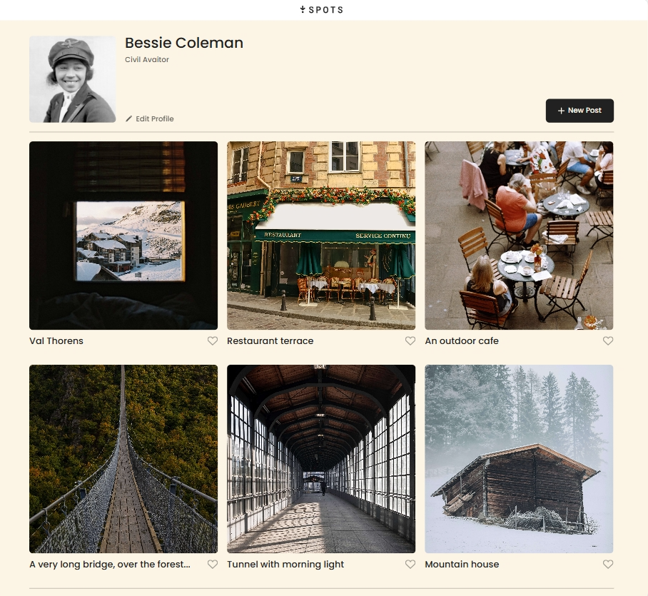
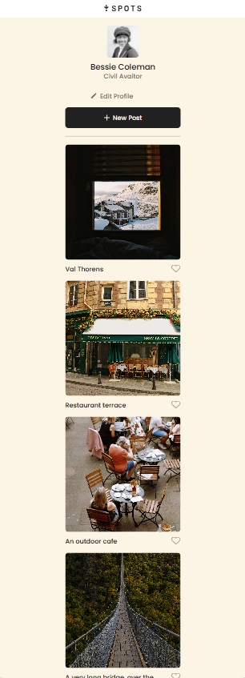

# Project 3: Spots

### Overview

- Intro
- Figma
- Images

## description

This project focused on turning a Figma design into a fully functional web interface. The goal was to match the layout, colors, and overall look of the original design as closely as possible. Attention to detail was important to keep everything consistent and visually accurate. Both desktop and mobile versions were created to ensure it works well on different screen sizes.

## functionality and the technologies

#### functionality

The project features a responsive layout that adapts to both desktop and mobile screen sizes. It includes structured sections like a header, main content, and footer for clear organization. Navigation elements such as links and buttons. The design stays consistent with the original Figma layout in terms of spacing, colors, and typography.

#### technologies and techniques

The project uses HTML to structure the content and CSS to style the layout, colors, and typography. Responsive design techniques were applied to ensure the layout adapts to both desktop and mobile screen sizes. This includes the use of flexible layouts and media queries. The design closely follows the original Figma layout, maintaining consistency in spacing and visual elements

**Intro**

This project is made so all the elements are displayed correctly on popular screen sizes. We recommend investing more time in completing this project, since it's more difficult than previous ones.

**Figma**

- [Link to the project on Figma](https://www.figma.com/file/BBNm2bC3lj8QQMHlnqRsga/Sprint-3-Project-%E2%80%94-Spots?type=design&node-id=2%3A60&mode=design&t=afgNFybdorZO6cQo-1)

**Images**

## Project Pitch Video

[Loomm video](loom.com/share/4a728cb8f821431a84dee6ac15da1152)

## deployment link

https://cephasabiangama22-design.github.io/se_project_spots/
